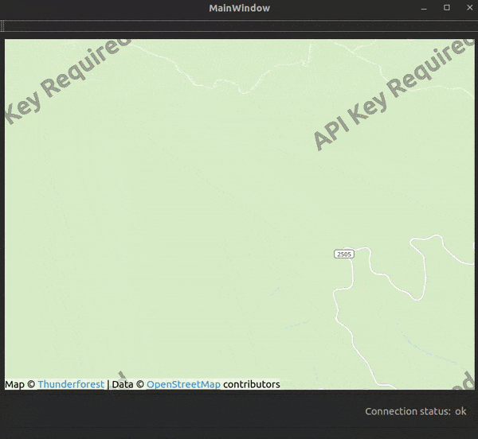

## QMsgMap


A simple C++/Qt application that displays a map and connects to a RabbitMQ exchange.

The application continuously receives map positions (name + latitude + longitude) and displays them on the map.
It is possible to delete received positions with a mouse click. You can use your mouse and your mouse wheel to
highlight a position on the map until it automatically fits to all of the points. The auto-fit refresh time is 5 seconds.

The working behavior is demonstrated in the following ~60 seconds long GIF:



---

## Demo scenario

At first, the application receives the following list of coordinates as separate JSON messages from RabbitMQ:

```python
towns = [
    {"name": "Miskolc", "lat": 48.104385, "lon": 20.786377},
    {"name": "Ózd", "lat": 48.210197, "lon": 20.302605},
    {"name": "Sátoraljaújhely", "lat": 48.400527, "lon": 21.647365},
    {"name": "Mezőkövesd", "lat": 47.844430, "lon": 20.573622},
    {"name": "Kazincbarcika", "lat": 48.256360, "lon": 20.631828},
    {"name": "Szikszó", "lat": 48.075255, "lon": 20.914543},
    {"name": "Szerencs", "lat": 48.300048, "lon": 21.055121},
    {"name": "Edelény", "lat": 48.298736, "lon": 21.261354},
    {"name": "Putnok", "lat": 48.253407, "lon": 20.576210},
    {"name": "Tiszaújváros", "lat": 47.911592, "lon": 21.064772},
    {"name": "Szirmabesenyő", "lat": 48.150950, "lon": 20.795700},
    {"name": "Sajósenye", "lat": 48.303818, "lon": 20.858604}
]
```

Later, another group of coordinates arrives from Hawaii to demonstrate automatic zooming:

```python
cities_hawaii = [
    {"name": "Honolulu", "lat": 21.3069, "lon": -157.8583},
    {"name": "East Honolulu", "lat": 21.3069, "lon": -157.7417},
    {"name": "Pearl City", "lat": 21.3972, "lon": -157.9733},
    {"name": "Hilo", "lat": 19.6994, "lon": -155.0858},
    {"name": "Kailua", "lat": 21.4022, "lon": -157.7394},
    {"name": "Waipahu", "lat": 21.3867, "lon": -158.0092},
    {"name": "Kaneohe", "lat": 21.4092, "lon": -157.7993},
    {"name": "Mililani Town", "lat": 21.4500, "lon": -158.0236},
    {"name": "Kahului", "lat": 20.8895, "lon": -156.4720},
    {"name": "Ewa Gentry", "lat": 21.3209, "lon": -158.0198},
    {"name": "Princeville", "lat": 22.2190, "lon": -159.4825}
]
```

---

# Build & Run

Tested on Ubuntu 22.04 with Qt 6.5.x.

The application expects a **direct exchange** named `positions`.
Routing key: `positions`.

You need a running RabbitMQ server.

---

## Dependencies (Ubuntu/Debian)

```bash
sudo apt update
sudo apt install -y \
  build-essential cmake pkg-config \
  qt6-base-dev qt6-declarative-dev \
  qml6-module-qtquick qml6-module-qtquick-controls qml6-module-qtquick-controls2 \
  qml6-module-qtlocation qml6-module-qtpositioning \
  librabbitmq-dev \
  libboost-all-dev
```

SimpleAmqpClient is fetched and built automatically by CMake (FetchContent).

---

## Build

```bash
cmake -S . -B build -DCMAKE_BUILD_TYPE=Release
cmake --build build -j
```

---

## Run

Start RabbitMQ:

```bash
sudo systemctl start rabbitmq-server
```

Run the application:

```bash
./build/qmsgmap
```

---

## Optional: Python demo publisher

Install dependency:

```bash
python3 -m pip install pika
```

Run this script:

```python
from time import sleep
import pika
import json

towns = [
    {"name": "Miskolc", "lat": 48.104385, "lon": 20.786377},
    {"name": "Ózd", "lat": 48.210197, "lon": 20.302605}
]

connection = pika.BlockingConnection(pika.ConnectionParameters('localhost'))
channel = connection.channel()

exchange_name = 'positions'
channel.exchange_declare(exchange=exchange_name, exchange_type='direct')

for data in towns:
    json_string = json.dumps(data)
    channel.basic_publish(exchange=exchange_name,
                          routing_key=exchange_name,
                          body=json_string)
    print(f"Sent: {json_string}")
    sleep(1.0)

connection.close()
```

---

## Troubleshooting

If you see:

```
module "QtQuick.Controls" is not installed
```

Install missing QML modules:

```bash
sudo apt install qml6-module-qtquick-controls qml6-module-qtquick-controls2
```

---

## License

This project is licensed under the MIT License.  
See LICENSE file for details.

Third-party components are listed in THIRD_PARTY_NOTICES.md.